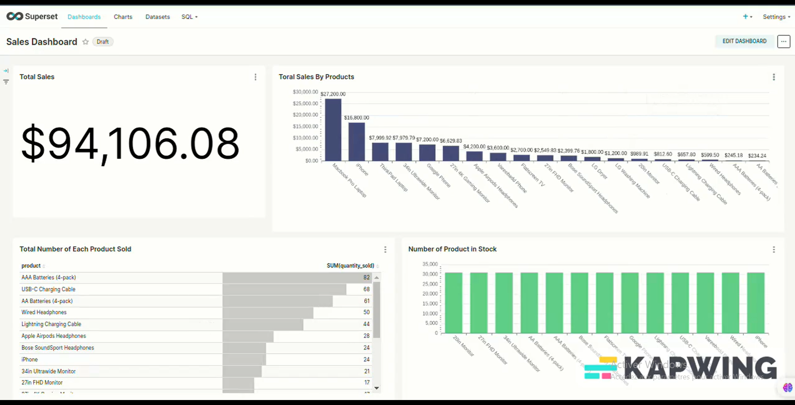

# 📈 Real-Time Sales Dashboard

Ce projet met en œuvre une pipeline complète de traitement et de visualisation de données de ventes en temps réel. Il s'appuie sur **Apache Kafka** pour l'ingestion, **Apache Spark Structured Streaming** pour le traitement, **PostgreSQL** pour le stockage, et **Dash (Python)** pour la visualisation via un tableau de bord dynamique.

## 🎯 Objectif

- Simuler un flux de ventes en temps réel  
- Traiter les données en continu via Spark Streaming  
- Stocker les résultats dans une base PostgreSQL  
- Afficher les KPIs de vente et l’état des stocks en direct

## ⚙️ Stack technique

| Technologie     | Usage                                                                 |
|----------------|------------------------------------------------------------------------|
| Kafka           | Ingestion des flux de vente en temps réel                             |
| Spark Streaming | Traitement des messages Kafka via Structured Streaming                |
| PostgreSQL      | Stockage des données de vente et des stocks                           |
| Dash (Python)   | Application de visualisation du tableau de bord                       |
| Docker Compose  | Orchestration des services dans des conteneurs                        |

## 🚀 Lancement du projet

```bash
# Cloner le projet
git clone https://github.com/Yamine-coder/real-time-sales-dashboard.git
cd real-time-sales-dashboard

# Lancer l’ensemble de l’environnement
docker-compose up --build
```

- 📊 Dashboard disponible sur : [http://localhost:8050](http://localhost:8050)  
- 🗄️ PostgreSQL disponible sur le port : `5432`

## 📂 Structure du projet

```
├── producer/              → Producteur Kafka en Python
├── spark_app/             → Traitement Spark Streaming
├── app/                   → Interface Dash pour visualisation
├── docker-compose.yml     → Orchestration des services
├── README.md
```

## 🧪 Données simulées

Chaque transaction contient :
- Timestamp (`datetime`)  
- ID produit  
- Quantité vendue  
- Stock restant après vente  

Les messages sont produits automatiquement et envoyés dans un topic Kafka, traités en temps réel par Spark, puis stockés dans PostgreSQL.

## 🎥 Démonstration vidéo

[ alt="Aperçu de la vidéo" width="700"/>

> 📽️ [Clique ici pour visionner la vidéo complète](./images/demo-real-time-dashboard.mp4)

## 👨‍💻 Auteur

**Yamine Moussaoui**  
🎓 MSc Intelligence Artificielle & Big Data  
💼 Consultant en Solutions Data & IA  
🔗 [LinkedIn](https://www.linkedin.com/in/yamine-moussaoui-672a25205/)   
📧 moussaouiyamine1@gmail.com  
🔎 [GitHub](https://github.com/Yamine-coder)


## 🏷️ Tags GitHub 

`real-time` `data-pipeline` `spark` `kafka` `postgresql` `dashboard` `data-engineering`

> *Une solution moderne et évolutive pour visualiser l’activité commerciale en temps réel.*
